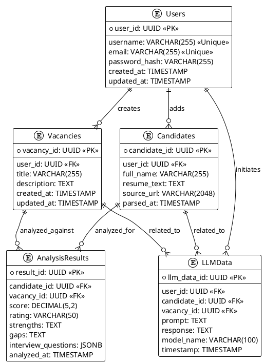

# 1. Проектирование схемы БД

## Основные сущности

| Сущность            | Назначение                                       |
| ------------------- | ------------------------------------------------ |
| **Users**           | Пользователи системы и владельцы данных          |
| **Vacancies**       | Вакансии, созданные пользователем                |
| **Candidates**      | Кандидаты, добавляемые пользователем             |
| **AnalysisResults** | Результаты анализа резюме и вакансии             |
| **LLMData**         | Сырые данные взаимодействий LLM (промпт → ответ) |

---
## Описание сущностей

### 1. `Users`

**Поля:**

*   `user_id` (UUID, PK): Уникальный идентификатор пользователя.
*   `username` (varchar, unique): Уникальное имя пользователя.
*   `email` (varchar, unique): Уникальный адрес электронной почты пользователя.
*   `password_hash` (varchar): Хеш пароля пользователя для безопасного хранения.
*   `created_at` (timestamp): Дата и время создания записи пользователя.
*   `updated_at` (timestamp): Дата и время последнего обновления записи пользователя.

---

### 2. `Vacancies`

**Поля:**

*   `vacancy_id` (UUID, PK): Уникальный идентификатор вакансии.
*   `user_id` (UUID, FK → Users): Идентификатор пользователя (HR), создавшего вакансию. Ссылка на таблицу `Users`.
*   `title` (varchar): Название вакансии.
*   `description` (text): Подробное описание вакансии.
*   `created_at` (timestamp): Дата и время создания записи вакансии.
*   `updated_at` (timestamp): Дата и время последнего обновления записи вакансии.

---

### 3. `Candidates`

**Поля:**

*   `candidate_id` (UUID, PK): Уникальный идентификатор кандидата.
*   `user_id` (FK → Users): Идентификатор пользователя (HR), который загрузил резюме. Ссылка на таблицу `Users`.
*   `full_name` (varchar): Полное имя кандидата.
*   `resume_text` (text): Полный текст резюме кандидата.
*   `source_url` (varchar): URL-адрес источника, откуда было получено резюме (если применимо).
*   `parsed_at` (timestamp): Дата и время, когда резюме было успешно обработано (спарсено).

---

### 4. `AnalysisResults`

**Поля:**

*   `result_id` (PK): Уникальный идентификатор результата анализа.
*   `candidate_id` (FK → Candidates): Идентификатор кандидата, прошедшего анализ. Ссылка на таблицу `Candidates`.
*   `vacancy_id` (FK → Vacancies): Идентификатор вакансии, под которую проводился анализ. Ссылка на таблицу `Vacancies`.
*   `score` (decimal): Числовая оценка соответствия кандидата вакансии.
*   `rating` (varchar): Категориальная оценка (например, "Высокое соответствие", "Среднее", "Низкое").
*   `strengths` (text): Описание сильных сторон кандидата относительно вакансии.
*   `gaps` (text): Описание пробелов или недостатков кандидата относительно вакансии.
*   `interview_questions` (jsonb): Список вопросов для собеседования, сгенерированных на основе анализа (в формате JSON).
*   `analyzed_at` (timestamp): Дата и время проведения анализа.

---

### 5. `LLMData`

**Поля:**

*   `llm_data_id` (PK): Уникальный идентификатор записи LLM данных.
*   `user_id` (FK → Users): Идентификатор пользователя (HR), инициировавшего запрос. Ссылка на таблицу `Users`.
*   `candidate_id` (FK → Candidates): Идентификатор кандидата, связанного с данным запросом (если применимо). Ссылка на таблицу `Candidates`.
*   `vacancy_id` (FK → Vacancies): Идентификатор вакансии, связанной с данным запросом (если применимо). Ссылка на таблицу `Vacancies`.
*   `prompt` (text): Текст запроса (промпт), отправленный LLM.
*   `response` (text): Ответ, полученный от LLM.
*   `model_name` (varchar): Название модели LLM, использованной для генерации ответа.
*   `timestamp` (timestamp): Дата и время выполнения запроса к LLM.
---

## 1.2 ER-диаграмма

## Описание связей:

| Связь                        | Тип | Описание                                                           |
| ---------------------------- | --- | ------------------------------------------------------------------ |
| Users → Vacancies            | 1:N | Пользователь может создать много вакансий                          |
| Users → Candidates           | 1:N | Пользователь добавляет много кандидатов                            |
| Candidates → AnalysisResults | 1:N | Каждое резюме может иметь множество анализов (по разным вакансиям) |
| Vacancies → AnalysisResults  | 1:N | Вакансия может анализироваться с разными кандидатами               |
| Users → LLMData              | 1:N | Каждое взаимодействие с LLM привязано к пользователю               |
| Candidates → LLMData         | 1:N | Промпт связан с конкретным кандидатом                              |
| Vacancies → LLMData          | 1:N | Промпт относится к конкретной вакансии                             |

---

## Индексы и производительность

| Таблица         | Поле                     | Тип индекса   | Зачем                           |
| --------------- | ------------------------ | ------------- | ------------------------------- |
| Users           | email, username          | UNIQUE        | Быстрый логин                   |
| Vacancies       | user_id                  | BTREE         | Получение вакансий пользователя |
| Candidates      | user_id                  | BTREE         | Список кандидатов владельца     |
| Candidates      | full_name                | GIN (trigram) | Поиск по имени                  |
| AnalysisResults | candidate_id, vacancy_id | BTREE         | Быстрый фильтр анализов         |
| AnalysisResults | score                    | BTREE         | Сортировка по рейтингу          |
| LLMData         | timestamp                | BTREE         | Аналитика, отложенная обработка |
| LLMData         | model_name               | BTREE         | Фильтрация по модели            |

---

## Схема для LLM данных

