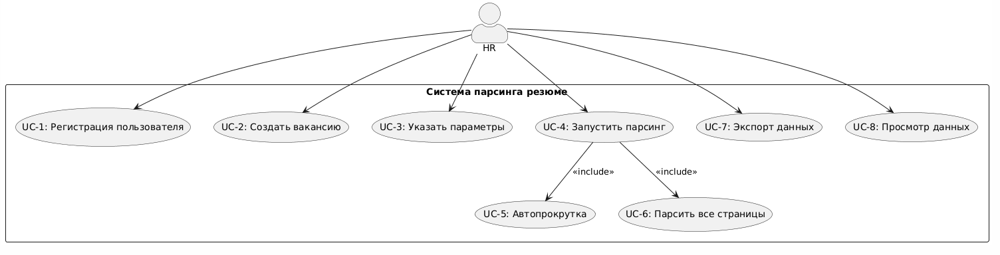

# D2: Use-case Narrative - AI Meal Planner

## Список Use Cases (Сценарии Использования)

*   Регистрация пользователя
*   Создать вакансию
*   Указать параметры
*   Запустить парсинг
*   Автопрокрутка
*   Парсить все страницы
*   Экспорт данных
*   Просмотр данных 

---

## Use-case Diagram

---

### UC-1: Регистрация пользователя

*   **Актор:** HR
*   **Предусловия:** Пользователь не авторизован.
*   **Основной поток:**
    1.  HR открывает страницу регистрации.
    2.  Вводит e-mail, пароль, подтверждает данные.
    3.  Получает доступ к системе.
*   **Постусловия:** Пользователь зарегистрирован и может создавать вакансии.

*   **Таблица эмоций:**

    | Сценарий                                      | Описание эмоции                                       |
    | :-------------------------------------------- | :---------------------------------------------------- |
    | **Happy Path**                                | Радость: регистрация быстрая и успешная               |
    | **Alternative Flow 1**                        | Лёгкое раздражение: требуется повторная отправка e-mail подтверждения |
    | **Alternative Flow 2**                        | Удивление: система предлагает восстановление пароля     |
    | **Error Scenario 1**                          | Frustration: e-mail уже занят                          |
    | **Error Scenario 2**                          | Отчаяние: сервер недоступен                           |

---

### UC-2: Создать вакансию

*   **Актор:** HR
*   **Предусловия:** HR авторизован.
*   **Основной поток:**
    1.  HR открывает страницу выбора вакансии.
    2.  Выбирает существующую вакансию или создаёт новую.
*   **Постусловия:** Вакансия выбрана, её параметры загружены.

*   **Таблица эмоций:**

    | Сценарий                               | Эмоции                                       |
    | :------------------------------------- | :------------------------------------------- |
    | **Happy Path**                         | Интерес, лёгкое удовлетворение               |
    | **Alternative Flow 1**                 | Сомнение при выборе шаблона вакансии         |
    | **Alternative Flow 2**                 | Неуверенность, если вакансий много            |
    | **Error Scenario 1**                   | Раздражение: вакансия не сохраняется         |
    | **Error Scenario 2**                   | Ошибка загрузки параметров вакансии           |

---

### UC-3: Указать параметры

*   **Актор:** HR
*   **Предусловия:** Вакансия выбрана.
*   **Основной поток:**
    1.  HR открывает форму параметров.
    2.  Указывает дату, фильтры, настройки поиска.
    3.  Сохраняет параметры.
*   **Постусловия:** Параметры прикреплены к вакансии.

*   **Таблица эмоций:**

    | Сценарий                               | Эмоции                                       |
    | :------------------------------------- | :------------------------------------------- |
    | **Happy Path**                         | Чувство контроля, уверенность                |
    | **Alternative Flow 1**                 | Нейтральность: часть параметров заполнена автоматически |
    | **Alternative Flow 2**                 | Неудобство: параметров слишком много         |
    | **Error Scenario 1**                   | Ошибка валидации                             |
    | **Error Scenario 2**                   | Параметры не сохраняются                     |

---

### UC-4: Запустить парсинг

*   **Актор:** HR
*   **Предусловия:** Указаны параметры вакансии.
*   **Основной поток:**
    1.  HR нажимает "Начать парсинг".
    2.  Система включается и запускает автоматический сбор данных.
    3.  Происходит автопрокрутка и сбор всех страниц (через include UC-5 и UC-6).
*   **Постусловия:** Парсинг запущен, данные собираются.

*   **Таблица эмоций:**

    | Сценарий                               | Эмоции                                       |
    | :------------------------------------- | :------------------------------------------- |
    | **Happy Path**                         | Воодушевление: процесс успешно стартовал    |
    | **Alternative Flow 1**                 | Ожидание: система просит уточнить параметры |
    | **Alternative Flow 2**                 | Нейтральность: длительная загрузка           |
    | **Error Scenario 1**                   | "Не удалось определить текущую страницу"     |
    | **Error Scenario 2**                   | Парсинг остановился из-за капчи             |

---

### UC-5: Автопрокрутка (include)

*   **Актор:** HR (косвенно, через UC-4)
*   **Предусловия:** Парсинг запущен.
*   **Основной поток:**
    1.  Система автоматически прокручивает страницу вниз.
    2.  Загружает новые результаты.
*   **Постусловия:** Все видимые данные собраны.

*   **Таблица эмоций:**

    | Сценарий                               | Эмоции                                       |
    | :------------------------------------- | :------------------------------------------- |
    | **Happy Path**                         | Спокойствие: всё происходит автоматически    |
    | **Alternative Flow 1**                 | Лёгкое ожидание: медленный скролл            |
    | **Alternative Flow 2**                 | Неудобство: сайт тормозит                    |
    | **Error Scenario 1**                   | Скролл не работает из-за обновления DOM      |
    | **Error Scenario 2**                   | Страница не загружается                      |

---

### UC-6: Парсить все страницы (include)

*   **Актор:** HR
*   **Предусловия:** Парсинг активен.
*   **Основной поток:**
    1.  Система определяет количество страниц.
    2.  По очереди открывает каждую страницу.
    3.  Собирает данные.
*   **Постусловия:** Все страницы обработаны.

*   **Таблица эмоций:**

    | Сценарий                               | Эмоции                                       |
    | :------------------------------------- | :------------------------------------------- |
    | **Happy Path**                         | Интерес: виден стабильный прогресс          |
    | **Alternative Flow 1**                 | Усталость: страниц слишком много             |
    | **Alternative Flow 2**                 | Нейтральность: процесс монотонный            |
    | **Error Scenario 1**                   | "Страница не найдена"                        |
    | **Error Scenario 2**                   | Циклический редирект                         |

---

### UC-7: Экспорт данных

*   **Актор:** HR
*   **Предусловия:** Собраны данные.
*   **Основной поток:**
    1.  HR выбирает формат экспорта: CSV / Google Sheets / Telegram.
    2.  Система создаёт файл или отправляет данные.
*   **Постусловия:** Данные экспортированы.

*   **Таблица эмоций:**

    | Сценарий                               | Эмоции                                       |
    | :------------------------------------- | :------------------------------------------- |
    | **Happy Path**                         | Удовлетворение: данные успешно получены      |
    | **Alternative Flow 1**                 | Выбор другого формата                        |
    | **Alternative Flow 2**                 | Запрос экспорта нескольких файлов            |
    | **Error Scenario 1**                   | CSV пустой                                   |
    | **Error Scenario 2**                   | Ошибка API Google Sheets                     |

---
