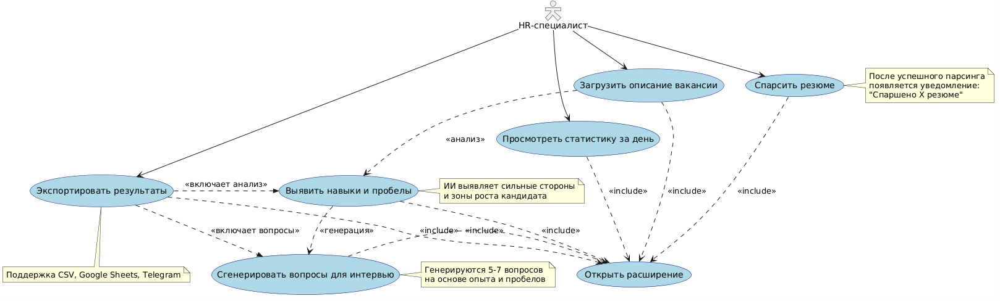
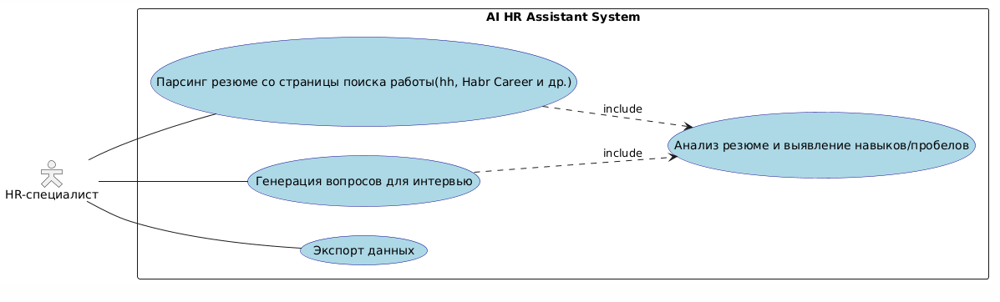

## Use-Case: Автоматический анализ резюме и подготовка к интервью

**Actor:** HR-специалист (зарегистрированный и авторизованный)  
**Goal:** Получить структурированный список кандидатов с оценкой соответствия вакансии, выявленными навыками и пробелами, а также персонализированными вопросами для собеседования - за минимальное время.

---

## Общее описание сценария

| Пункт | Описание |
|-------|----------|
| **Назначение сценария** | Автоматизировать первичный отбор кандидатов: проанализировать резюме, ранжировать по соответствию вакансии, выявить ключевые навыки и пробелы, сгенерировать персонализированные вопросы для интервью. |
| **Предусловия** | - Установлено браузерное расширение AI HR Assistant - Пользователь авторизован с аккаунта компании - Пользователь находится на странице с резюме (hh, Habr Career и др.) - Загружено или введено описание вакансии - Страница с резюме полностью загружена |
| **Участники** | HR-специалист, Менеджер по найму |
| **Критерий успешности сценария** | - Резюме успешно спаршены и структурированы - Сформирован рейтинг кандидатов (Top / Medium / Low) - Вычислен скоринг соответствия (0-100%) - Выявлены сильные стороны и пробелы у кандидатов - Есть возможность сгенерировать 5-7 персонализированных вопросов - Данные доступны для экспорта в CSV или Google Sheets |
| **Инициирующее событие** | Нажатие кнопки «Начать парсинг» или «Анализировать по вакансии» в панели расширения |

---

## Целевые сегменты пользователей

| Сегмент | Основная задача | Ключевая потребность |
|---------|----------------|-----------------------|
| HR-специалисты рекрутинговых агентств | Подбор большого количества кандидатов на разные позиции | Быстро отсеивать неподходящих и выделять топ-кандидатов |
| HR-отделы компаний среднего бизнеса | Массовый подбор персонала | Автоматизация рутинных задач: парсинг, сравнение, экспорт |
| Руководители команд / менеджеры по найму | Участие в собеседованиях | Получение готовых, релевантных вопросов без анализа резюме |

---

## Основные боли пользователей
- Высокие временные затраты на чтение и анализ десятков или сотен резюме.  
- Риск субъективной ошибки при отборе кандидатов.  
- Сложность в выявлении реальных навыков и пробелов на основе текста резюме.  
- Отсутствие единой системы обработки резюме в разных форматах (PDF, DOCX, текст).  
- Недостаток инструментов для подготовки содержательного собеседования на основе данных кандидата.  

---

## Декомпозиция системы
На основе проблематики, а также с учетом фокуса на HR-отделах компаний среднего бизнеса, выделены следующие ключевые use-cases:

| Атрибут | Описание |
|--------|---------|
| **Название** | Автоматический парсинг и анализ резюме с генерацией вопросов для интервью |
| **Описание** | Автоматизация массового отбора: парсинг резюме с job-порталов, анализ соответствия вакансии, ранжирование кандидатов, генерация персонализированных вопросов для собеседования |
| **Акторы** | HR-специалист, Расширение AI HR Assistant |
| **Начальное состояние** | Расширение установлено, пользователь авторизован, открыта страница с резюме на поддерживаемом портале (hh.ru, Habr Career и др.) |
| **Триггер** | Нажатие кнопки **"Начать парсинг"** в интерфейсе расширения |
| **Успешный сценарий** | 1. Парсинг резюме → 2. Анализ соответствия вакансии → 3. Ранжирование кандидатов → 4. Генерация вопросов → 5. Экспорт результатов |
| **Альтернативный сценарий** | Анализ без привязки к вакансии — общая оценка навыков и опыта (режим структуризации) |
| **Негативный сценарий** | Ошибка определения страницы: система не распознаёт страницу с резюме (например, открыта вакансия вместо списка кандидатов) |
| **Конечное состояние** | Структурированный список кандидатов со скорингом соответствия (0–100%) и готовыми вопросами для интервью |

## Use-case диаграмма

---

| Атрибут | Описание |
|--------|---------|
| **Название** | AI-анализ резюме с выявлением соответствия вакансии |
| **Описание** | Автоматический анализ спаршенного резюме, сравнение с требованиями вакансии, расчёт скоринга и выявление сильных сторон / пробелов |
| **Акторы** | HR-специалист, Расширение AI HR Assistant |
| **Начальное состояние** | Резюме успешно спаршено и сохранено в системе, описание вакансии загружено |
| **Триггер** | Автоматически после парсинга или вручную — при выборе кандидата и нажатии «Анализировать» |
| **Успешный сценарий** | 1. Извлечение навыков и опыта → 2. Сравнение с требованиями вакансии → 3. Расчёт скоринга соответствия → 4. Выявление сильных сторон и пробелов → 5. Визуализация результатов |
| **Альтернативный сценарий** | Анализ без привязки к вакансии — общая оценка навыков по внутренним стандартам системы |
| **Негативный сценарий** | Технический сбой AI-модели или некорректный формат данных резюме (например, скан без текста) |
| **Конечное состояние** | Профиль кандидата дополнен: скорингом, списком навыков, сильными сторонами и пробелами |

## Use-case диаграмма

---

| Атрибут | Описание |
|--------|---------|
| **Название** | Генерация персонализированных вопросов для собеседования |
| **Описание** | Автоматическое создание релевантных вопросов на основе анализа резюме кандидата и требований вакансии |
| **Акторы** | HR-специалист, Расширение AI HR Assistant |
| **Начальное состояние** | Резюме проанализировано, выявлены навыки и пробелы, описание вакансии доступно в системе |
| **Триггер** | Нажатие кнопки **"Сгенерировать вопросы для интервью"** в профиле кандидата |
| **Успешный сценарий** | 1. Анализ данных кандидата → 2. Генерация 5–7 персонализированных вопросов → 3. Фокусировка на ключевых компетенциях и пробелах → 4. Отображение готовых вопросов |
| **Альтернативный сценарий** | Регенерация вопросов с другим уклоном (технические / поведенческие / опыт) или выбор фокуса пользователем |
| **Негативный сценарий** | Недостаток данных в резюме (например, отсутствуют достижения или детали опыта), что ограничивает персонализацию |
| **Конечное состояние** | Сформирован и отображён набор релевантных вопросов для проведения интервью |

## Use-case диаграмма

---

| Атрибут | Описание |
|--------|---------|
| **Название** | Мультиформатный экспорт данных кандидатов |
| **Описание** | Экспорт спарсенных резюме и результатов анализа (скоринг, пробелы, вопросы) в различные форматы для дальнейшего использования |
| **Акторы** | HR-специалист, Расширение AI HR Assistant |
| **Начальное состояние** | Пользователь авторизован, имеются спарсенные и проанализированные резюме |
| **Триггер** | Выбор опции экспорта в интерфейсе расширения или веб-приложения |
| **Успешный сценарий** | 1. Выбор формата экспорта → 2. Выбор данных для выгрузки → 3. Формирование отчёта → 4. Экспорт в выбранный формат → 5. Подтверждение успешного выполнения |
| **Альтернативный сценарий** | Настройка интеграции с внешними сервисами при первом использовании (например, подключение Google Drive или Telegram) |
| **Негативный сценарий** | Отсутствие данных для экспорта или технический сбой при интеграции с внешним сервисом |
| **Конечное состояние** | Данные успешно экспортированы в выбранный формат и доступны для использования |

## Use-case диаграмма

---

## Ценность для пользователя

| Пользователь | Основная ценность |
|--------------|-------------------|
| HR-специалисты агентств | Ускорение закрытия вакансий в 5-6 раз. Возможность массового отбора с минимальными усилиями. |
| HR-отделы компаний | Снижение нагрузки на 60%. Автоматизация рутины при массовом найме. |
| Менеджеры по найму | Готовые вопросы позволяют проводить глубокие собеседования без предварительного анализа резюме. |
| Компании в целом | Повышение качества найма, снижение текучести кадров, объективность отбора. |

**Уникальная ценность продукта:**  
AI HR Assistant экономит время HR-специалистов и повышает качество найма, автоматически анализируя резюме, ранжируя кандидатов и подготавливая персонализированные вопросы для интервью.

---

## Use-case диаграмма

PlantUML:
<pre>@startuml
skinparam actorStyle Hollow
skinparam usecase {
  BackgroundColor LightBlue
  BorderColor DarkBlue
}
skinparam usecaseSpecification {
  BackgroundColor White
  BorderColor Gray
}

' Актор
:HR-специалист: as hr

' Use cases (без rank — как в реальном UI)
(Открыть расширение) as open
(Спарсить резюме) as parse
(Загрузить описание вакансии) as upload
(Выявить навыки и пробелы) as gaps
(Сгенерировать вопросы для интервью) as questions
(Просмотреть статистику за день) as stats
(Экспортировать результаты) as export

' Пользователь инициирует действия
hr --> parse
hr --> upload
hr --> export
hr --> stats

' Все действия требуют открытия расширения
parse .> open : <<include>>
upload .> open : <<include>>
gaps .> open : <<include>>
questions .> open : <<include>>
export .> open : <<include>>
stats .> open : <<include>>

' Внутренние зависимости (AI-логика)
upload ..> gaps : <<анализ>>
gaps ..> questions : <<генерация>>
export .>> gaps : <<включает анализ>>
export .>> questions : <<включает вопросы>>

' Уведомление после парсинга
note right of parse
  После успешного парсинга
  появляется уведомление:
  "Спаршено X резюме"
end note

note right of gaps
  ИИ выявляет сильные стороны
  и зоны роста кандидата
end note

note right of questions
  Генерируются 5–7 вопросов
  на основе опыта и пробелов
end note

note bottom of export
  Поддержка CSV, Google Sheets, Telegram
end note

@enduml
</pre>

## Definition of Done (DoD)

- [x] Описан детальный **Happy Path** для основного use-case  
- [x] Определены минимум **2 альтернативных сценария** (в документе их 4)  
- [x] Описано минимум **3 сценария ошибок** (в документе их 6)  
- [x] Для каждого сценария указана **конкретная ценность для пользователя**  
- [x] Созданы **Use-case UML диаграммы** (минимум 1 основная)  
- [x] Документ сохранён в репозитории по пути: `docs/use-cases.md`  
- [x] Проведен **walkthrough всех сценариев с командой**, получен ✅ от каждого участника.
